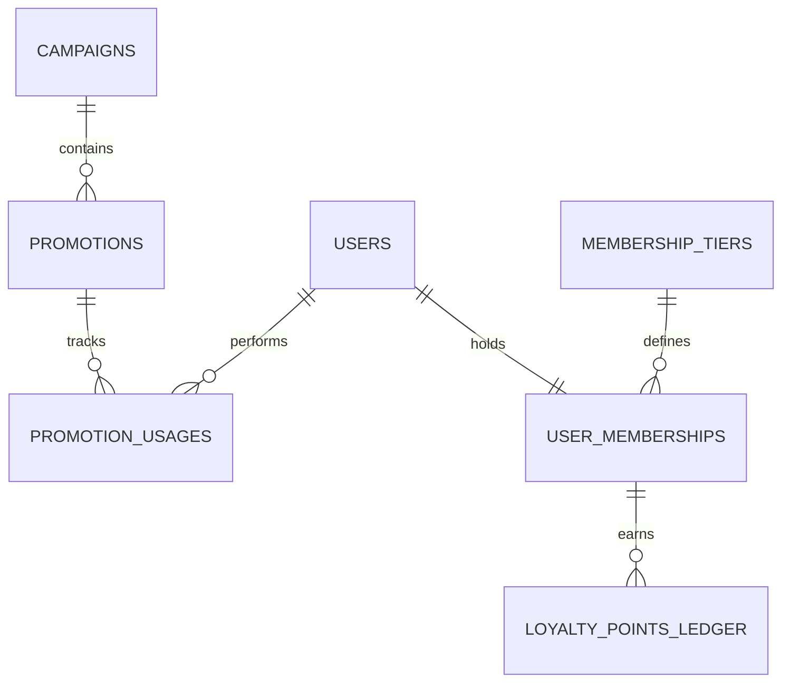

# Phase P1.8-S1: Promotion Business Redesign Audit

Date: 2026-06-21
Worker: Antigravity

## Scope

Analyze the current promotion, voucher, and marketing system in both the backend and web interfaces. Define a robust target promotion model that scales with campaigns, enforces strict user-level limits, supports membership tiers, and integrates securely with the transactional order and ticket payment flows.

---

## 1. Current State Analysis

### 1.1 Database Schema (`promotions` table)
The current schema (defined in [005_create_promotions.sql](file:///d:/01_university/year3/semester-5/mobile/final/Server-2025-Eventing/db/migrations/005_create_promotions.sql)) is simple:
- **Columns**: `id`, `organizer_id`, `code` (unique index), `event_id` (nullable), `valid_from`, `valid_until`, `usage_limit`, `used_count`, `is_public`, `data` (JSONB), and `created_at`.
- **Limitation**: The design assumes only single, independent coupon codes exist. There is no concept of a "Campaign" grouping multiple codes, no customer eligibility filters, and no tracking of which users have used which coupons.

### 1.2 Backend Validation Logic
In the tickets application service ([service.js](file:///d:/01_university/year3/semester-5/mobile/final/Server-2025-Eventing/src/modules/tickets/application/service.js)), ticket bookings call `applyPromotion` when a `promoCode` is provided:
- Checks if the promotion is expired, reached its global usage limit, requires a minimum ticket quantity, or belongs to a different event.
- Increments `used_count` transactionally.
- **Defect**: The code increments `used_count` during the initial booking (before payment). If the payment fails, expires, or the customer cancels the pending ticket, **the promotion usage is never rolled back**. This makes it easy to lock out a promo code via dummy unpaid bookings.

### 1.3 Web Frontend Integration Gaps
In [checkout/page.tsx](file:///d:/01_university/year3/semester-5/mobile/final/web-2025-eventing/src/app/checkout/page.tsx):
- **Hardcoded Codes**: Coupon codes (`EVENTING20` for 20% discount and `WELCOME10` for 10% up to 50k discount) are evaluated entirely client-side using JavaScript `if/else` logic.
- **No Backend Validation**: The frontend does not execute a request to the backend's `/promotions/apply` validation route.
- **Unapplied Discount**: When sending the ticket booking request, the web app calls `ticketsApi.bookTickets` but **does not pass the `promoCode` to the API**. Consequently:
  1. The backend books the ticket at the full original price.
  2. The payment order to ZaloPay is generated for the full price.
  3. The user sees a discounted price on the checkout UI but is charged the full price on the payment gateway.

---

## 2. Current Gap Matrix

| Feature Domain | Current State | Target Design (Redesign Goal) | Priority |
| :--- | :--- | :--- | :--- |
| **Campaign Management** | Non-existent. Promotions are ad-hoc and standalone. | **Campaigns Entity**: Group multiple promotions, define collective budget caps, track marketing performance. | Medium |
| **User Eligibility & Abuse** | No per-user limits. Any user can reuse the same coupon infinite times. | **User Limit Enforcement**: Max usage per user, restricted to first-time buyers, or locked to specific users. | High |
| **Scope of Applicability** | Restricted to an entire event. | **Granular Scopes**: Valid for specific ticket types (e.g. Regular only) or minimum order value thresholds. | High |
| **Transactional Consistency** | Leakage on failed/unpaid orders. No decrement on cancel/refund. | **Two-Phase Lock/Release**: Reserve promo usage on booking, commit on payment success, release on cancel/expire/refund. | High |
| **Client-Side Security** | Hardcoded codes on frontend. Discount calculated client-side; no backend sync. | **BFF Promotion Sync**: UI queries `/promotions/apply` API. Ticket booking passes `promoCode` to backend. | Critical |
| **Loyalty & Membership Tiers** | None. No tiers or customer points. | **Membership System**: Define tiers (Standard, Silver, Gold, Platinum) with flat discounts and early-access privileges. | Medium |
| **Discount Stacking** | Single promo code allowed. | **Stacking Rules**: Block multiple codes, or calculate stacked discount order (Membership flat % + Voucher). | Low |

---

## 3. Target Database Redesign

To achieve the target design, we propose the following database schemas:



### 3.1 Schema Plan

#### 1. Campaigns (`campaigns` table)
Tracks high-level marketing campaigns, budgets, and schedules.
```sql
CREATE TABLE IF NOT EXISTS campaigns (
    id TEXT PRIMARY KEY,
    organizer_id TEXT NOT NULL,
    name TEXT NOT NULL,
    description TEXT,
    budget_limit NUMERIC NOT NULL DEFAULT 0.00,
    current_spend NUMERIC NOT NULL DEFAULT 0.00,
    status TEXT NOT NULL CHECK (status IN ('draft', 'active', 'paused', 'completed')),
    valid_from BIGINT NOT NULL,
    valid_until BIGINT NOT NULL,
    created_at BIGINT NOT NULL,
    updated_at BIGINT NOT NULL
);
CREATE INDEX IF NOT EXISTS idx_campaigns_organizer ON campaigns(organizer_id);
```

#### 2. Expanded Promotions (`promotions` table)
Refines the ad-hoc model to support scope, user limits, caps, and tier qualification.
```sql
CREATE TABLE IF NOT EXISTS promotions (
    id TEXT PRIMARY KEY,
    campaign_id TEXT REFERENCES campaigns(id) ON DELETE SET NULL,
    organizer_id TEXT NOT NULL,
    code TEXT NOT NULL UNIQUE,
    discount_type TEXT NOT NULL CHECK (discount_type IN ('percent', 'amount', 'fixed_price')),
    discount_value NUMERIC NOT NULL,
    max_discount_amount NUMERIC, -- Cap for percentage discounts (e.g. 10% off up to 50k)
    min_order_value NUMERIC DEFAULT 0.00,
    min_ticket_qty INT DEFAULT 1,
    usage_limit INT NOT NULL DEFAULT 0, -- Global max usage
    usage_limit_per_user INT NOT NULL DEFAULT 1, -- Max usage per user
    used_count INT NOT NULL DEFAULT 0,
    is_public BOOLEAN NOT NULL DEFAULT false,
    target_scope TEXT NOT NULL CHECK (target_scope IN ('global', 'event', 'ticket_type')),
    scope_id TEXT, -- event_id or ticket_type_id depending on target_scope
    eligible_tiers JSONB, -- list of eligible tiers, e.g. ["gold", "platinum"]
    valid_from BIGINT NOT NULL,
    valid_until BIGINT NOT NULL,
    created_at BIGINT NOT NULL,
    updated_at BIGINT NOT NULL
);
CREATE INDEX IF NOT EXISTS idx_promotions_scope ON promotions(target_scope, scope_id);
```

#### 3. Promotion Usages (`promotion_usages` table)
Solves the abuse vector by tracking per-user voucher status transactionally.
```sql
CREATE TABLE IF NOT EXISTS promotion_usages (
    id TEXT PRIMARY KEY,
    promotion_id TEXT NOT NULL REFERENCES promotions(id) ON DELETE RESTRICT,
    user_id TEXT NOT NULL,
    order_id TEXT NOT NULL,
    discount_applied NUMERIC NOT NULL,
    status TEXT NOT NULL CHECK (status IN ('reserved', 'confirmed', 'released')),
    created_at BIGINT NOT NULL,
    updated_at BIGINT NOT NULL
);
CREATE UNIQUE INDEX IF NOT EXISTS idx_user_promo_active ON promotion_usages(promotion_id, user_id) 
WHERE status IN ('reserved', 'confirmed');
CREATE INDEX IF NOT EXISTS idx_promotion_usages_order ON promotion_usages(order_id);
```

#### 4. Membership Tiers & User Points
Establishes the foundation for customer loyalty programs.
```sql
CREATE TABLE IF NOT EXISTS membership_tiers (
    id TEXT PRIMARY KEY,
    name TEXT NOT NULL UNIQUE, -- 'standard', 'silver', 'gold', 'platinum'
    min_points_required INT NOT NULL,
    discount_percentage NUMERIC NOT NULL DEFAULT 0.00, -- flat discount
    perks JSONB,
    created_at BIGINT NOT NULL
);

CREATE TABLE IF NOT EXISTS user_memberships (
    user_id TEXT PRIMARY KEY,
    tier_id TEXT NOT NULL REFERENCES membership_tiers(id),
    points_balance INT NOT NULL DEFAULT 0,
    lifetime_points INT NOT NULL DEFAULT 0,
    updated_at BIGINT NOT NULL
);

CREATE TABLE IF NOT EXISTS loyalty_points_ledger (
    id TEXT PRIMARY KEY,
    user_id TEXT NOT NULL,
    points INT NOT NULL, -- positive for earn, negative for burn
    transaction_type TEXT NOT NULL CHECK (transaction_type IN ('ticket_purchase', 'referral', 'bonus', 'refund')),
    reference_id TEXT, -- order_id or refund_id
    created_at BIGINT NOT NULL
);
CREATE INDEX IF NOT EXISTS idx_loyalty_user ON loyalty_points_ledger(user_id);
```

---

## 4. Transactional Accounting Rules for Promotions

1. **Voucher Validation & Reservation (`tickets:book`)**:
   - Acquire a row lock on the promotion (`SELECT * FROM promotions WHERE code = $1 FOR UPDATE`).
   - Validate eligibility: validity dates, global `used_count < usage_limit`, event scope, membership tier, and min price/qty.
   - Enforce user limits: Query `promotion_usages` count for the active user where `status IN ('reserved', 'confirmed')`. Verify it is below `usage_limit_per_user`.
   - Increment `used_count` in `promotions`.
   - Create a `promotion_usages` record with `status = 'reserved'`.
   - Complete ticket booking and shadow order creation.

2. **Order Payment Confirmation (`payments:callback` or manual check success)**:
   - Within the payment transaction, update the `promotion_usages` record for the order:
     `status = 'confirmed'`.
   - If the promotion is linked to a campaign, increment the campaign's `current_spend` by the discount value.

3. **Order Expiration / Cancellation (`orders:cancel` or payment failure)**:
   - Within the cancellation transaction, retrieve the `promotion_usages` record:
     - Update the usage status: `status = 'released'`.
     - Decrement the promotion's `used_count`:
       `UPDATE promotions SET used_count = used_count - 1 WHERE id = $1`.

4. **Order Refunds (`refunds:create`)**:
   - If the order containing the applied discount is fully refunded, transition the corresponding `promotion_usages` to `released` and decrement `used_count`.
   - If campaign spend was recorded, deduct the refunded discount from the campaign's `current_spend`.
