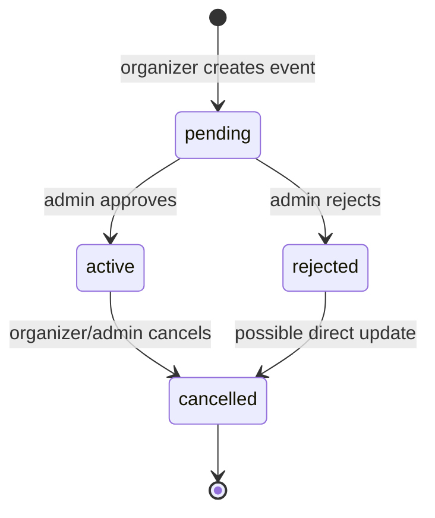
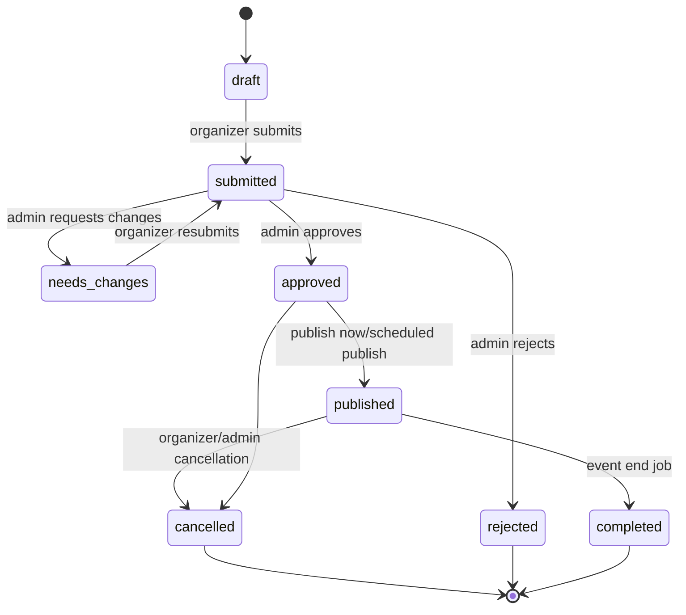
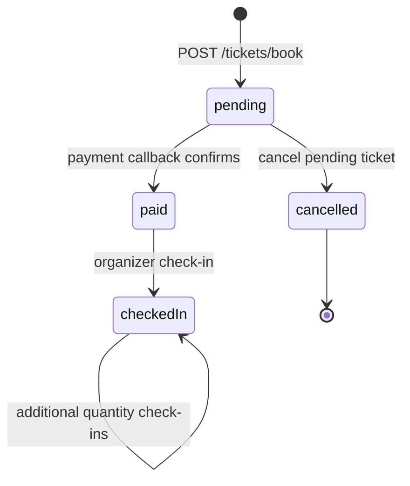
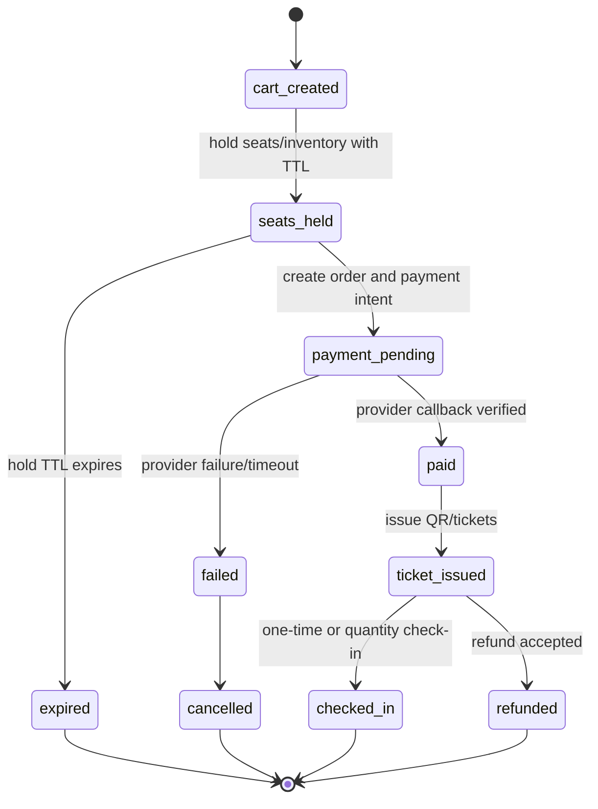
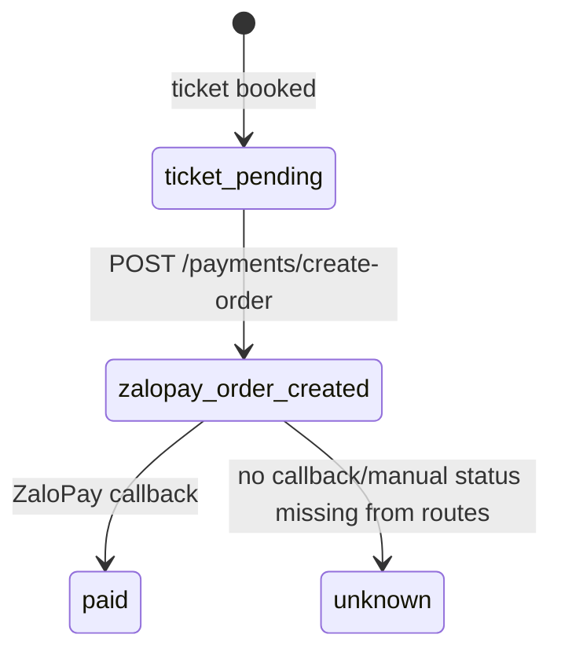
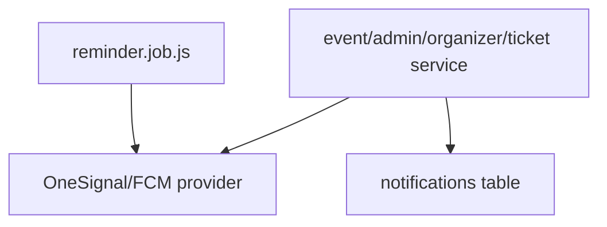
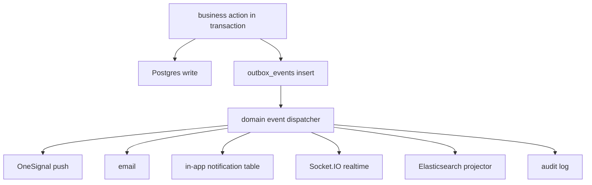

# Phase P1.0 - Domain Audit

Date: 2026-06-11

Mode: read-only audit. No source code changes.

Inputs:

- Phase P1 plan: `Agent Workflows/runs/business-redesign/phase-p1-business-redesign-plan.md`
- Backend worker: OpenCode read-only audit over `Server-2025-Eventing`
- Mobile worker: AGY attempted read-only audit but returned no report; OpenCode read-only audit was used for attendee and organizer mobile apps

## Executive Summary

The current system is stable enough to start business redesign, but the domain model is still closer to a demo event app than a Ticketbox/Eventbrite-style platform.

The highest-risk gaps are:

1. Auth/RBAC is too shallow: roles are string arrays, admin is a single `ADMIN_UID`, and organizer staff permissions do not exist.
2. Event lifecycle is not a real state machine: current event states are mostly `pending`, `active`, `rejected`, `cancelled`.
3. Ticketing has no order aggregate, no seat map, no seat hold TTL, and no idempotency key.
4. Payment is ZaloPay-only and ticket-attached, with no payment transaction/refund/payout/commission model.
5. Notifications, Elasticsearch indexing, and reminders are directly called inside business services; no domain event/outbox layer exists.
6. Promotion is a basic discount-code model and is not ready for membership, campaigns, eligibility rules, or platform-vs-organizer funding.
7. Web is completely missing as a full Eventing product surface for attendee, organizer, and admin.

Therefore, Phase P implementation must start with **P1.1 Auth/RBAC/Staff**, then **P1.2 Event Lifecycle**, then **P1.3 Ticket/Order/Seat/Concurrency**, before web UI or AI moderation.

## Current Product Surfaces

| Surface | Current State | Target |
| --- | --- | --- |
| Attendee Android | Existing and functional | Keep compatible while backend evolves |
| Organizer Android | Existing and functional | Keep for scan/check-in/lightweight management |
| Attendee Web | Missing | Full event discovery, checkout, tickets, reviews, account |
| Organizer Web | Missing | Full dashboard for event, ticketing, marketing, staff, finance |
| Admin Web | Missing | Moderation, verification, AI review, finance/compliance |

## Backend API Current Shape

Current routes are mostly flat:

```text
/auth/*
/events/*
/tickets/*
/payments/*
/organizer/*
/admin/*
/promotions/*
/notifications/*
/profiles/*
/venues/*
/storage/*
```

Phase P target should add BFF-style route boundaries without removing mobile-compatible routes immediately:

```text
/api/mobile/*       stable mobile contracts
/api/web/*          attendee web contracts
/api/organizer/*    organizer dashboard contracts
/api/admin/*        admin web contracts
/api/public/*       public catalog/search/event pages
```

Migration rule:

- Keep old mobile routes alive until attendee and organizer apps are explicitly migrated.
- Do not change payload shape for routes covered by `npm run db:smoke:mobile-contracts`.

## Domain State Diagrams

### Event Lifecycle - Current



Current evidence:

- `Server-2025-Eventing/src/modules/events/application/service.js`
- `Server-2025-Eventing/src/modules/admin/application/service.js`
- `Server-2025-Eventing/db/migrations/010_create_events.sql`

Current gaps:

- no draft state
- no submitted state separate from pending
- no published state separate from active
- no completed state
- no approval history
- no rejection reason persistence
- no timed-entry/multi-slot lifecycle
- no recurring event lifecycle behavior beyond raw `recurring_rule`

### Event Lifecycle - Target



### Ticket/Order Lifecycle - Current



Current evidence:

- `Server-2025-Eventing/src/modules/tickets/application/service.js`
- `Server-2025-Eventing/src/modules/organizer/application/service.js`
- `Server-2025-Eventing/db/migrations/011_create_tickets.sql`
- `Server-2025-Eventing/db/migrations/015_add_ticket_payment_fields.sql`

Current gaps:

- no `orders` table
- no `order_items` table
- no seat hold
- no seat map
- no explicit idempotency key
- no payment transaction table
- `seat` is free text
- `group_id` exists but group booking/share bill behavior is not implemented
- inventory is nested JSONB in event ticket types

### Ticket/Order Lifecycle - Target



### Payment Lifecycle - Current



Current evidence:

- `Server-2025-Eventing/src/modules/payments/application/service.js`
- `Server-2025-Eventing/src/modules/payments/api/controller.js`
- `Server-2025-Eventing/src/modules/payments/api/routes.js`

Current gaps:

- ZaloPay only
- no payment provider interface
- no payment transaction table
- no webhook idempotency
- no refund
- no payout
- no commission/platform fee
- no organizer balance
- manual payment status controller exists but route is not wired

### Notification Flow - Current



Current problem:

- business services call notification/search providers directly.

### Notification/Search Flow - Target



## Backend Domain Audit

### Auth/RBAC/Staff

Evidence:

- `Server-2025-Eventing/db/migrations/002_create_auth_tables.sql`
- `Server-2025-Eventing/src/modules/auth/api/routes.js`
- `Server-2025-Eventing/src/modules/auth/application/service.js`
- `Server-2025-Eventing/src/providers/auth/backend.auth.provider.js`
- `Server-2025-Eventing/src/shared/middleware/auth.middleware.js`
- `Server-2025-Eventing/src/shared/middleware/admin.middleware.js`

Current behavior:

- users have `roles TEXT[]`
- supported roles are mostly `user` and `organizer`
- admin access is tied to `ADMIN_UID`
- refresh-token sessions exist
- logout and logout-all exist

Gaps:

- no role table
- no permission table
- no organization membership table
- no organizer staff
- no admin role model
- no session/device management UI/API
- no audit log for auth/admin decisions

Phase implication:

- P1.1 must be first implementation phase.

### Events/Organizer

Evidence:

- `Server-2025-Eventing/db/migrations/010_create_events.sql`
- `Server-2025-Eventing/db/migrations/013_create_organizer_profiles.sql`
- `Server-2025-Eventing/src/modules/events/api/routes.js`
- `Server-2025-Eventing/src/modules/events/application/service.js`
- `Server-2025-Eventing/src/modules/organizer/api/routes.js`
- `Server-2025-Eventing/src/modules/organizer/application/service.js`

Current behavior:

- organizer creates event as `pending/private`
- admin approves to `active/public`
- admin rejects to `rejected`
- organizer can cancel
- organizer profile is basic
- attendee import/export/broadcast/check-in exist

Gaps:

- no draft/submit/resubmit workflow
- no event state transition policy
- no organizer business verification documents
- no organizer notification/reminder configuration
- no organizer staff assignment
- no event frequency/timed-entry model
- venue model is not structured for seats

### Tickets/Seats/Orders

Evidence:

- `Server-2025-Eventing/db/migrations/011_create_tickets.sql`
- `Server-2025-Eventing/src/modules/tickets/api/routes.js`
- `Server-2025-Eventing/src/modules/tickets/application/service.js`
- `Server-2025-Eventing/src/providers/database/postgres.ticket.repository.js`
- `Server-2025-Eventing/src/utils/qr.generator.js`

Current behavior:

- booking creates a pending ticket directly
- ticket type availability is decremented from event JSONB
- QR code is JWT-based
- check-in allows up to quantity count

Gaps:

- no order/order item
- no seat hold TTL
- no normalized inventory/seat model
- no explicit row lock policy documented at service level
- no idempotency key
- no ticket transfer/share bill/group booking implementation
- QR security needs short-lived validation/replay protection

### Payments/Finance

Evidence:

- `Server-2025-Eventing/src/modules/payments/api/routes.js`
- `Server-2025-Eventing/src/modules/payments/api/controller.js`
- `Server-2025-Eventing/src/modules/payments/application/service.js`
- `Server-2025-Eventing/src/modules/payments/infrastructure/config/zalopay.config.js`
- `Server-2025-Eventing/db/migrations/015_add_ticket_payment_fields.sql`

Current behavior:

- ZaloPay create order
- ZaloPay callback verifies MAC
- callback confirms ticket payment

Gaps:

- no payment provider port
- no payment transaction table
- no refund/payout/commission
- no organizer balance
- no idempotent webhook processing
- manual status check exists in controller but is not route-wired

### Notifications/Mail/Realtime

Evidence:

- `Server-2025-Eventing/db/migrations/003_create_notifications.sql`
- `Server-2025-Eventing/src/modules/notifications/application/service.js`
- `Server-2025-Eventing/src/modules/events/application/helpers/notification-sender.js`
- `Server-2025-Eventing/src/jobs/reminder.job.js`
- `Server-2025-Eventing/src/modules/auth/application/helpers/email.helper.js`
- `Server-2025-Eventing/src/providers/notification/onesignal.provider.js`

Current behavior:

- notification table supports basic in-app list/read
- OneSignal push exists
- email exists only for auth/password flows
- reminder job directly queries events/tickets and sends push

Gaps:

- no outbox
- no domain event dispatcher
- no email for ticket purchase/payment
- no Socket.IO
- no notification templates
- no retry/DLQ/delivery log
- no organizer-configurable reminder schedule

### Redis/Cache/Realtime

Evidence:

- no Redis dependency found
- no cache module found
- no Socket.IO dependency found

Gaps:

- no server-side cache-aside
- no shared rate-limit/session cache
- no realtime multi-device sync

### Search/Elasticsearch

Evidence:

- `Server-2025-Eventing/src/shared/config/elasticsearch.config.js`
- `Server-2025-Eventing/src/modules/events/application/service.js`
- `Server-2025-Eventing/src/modules/admin/application/service.js`
- `Server-2025-Eventing/scripts/reindex.elasticsearch.js`

Current behavior:

- events service searches Elasticsearch directly
- events/admin service index/delete directly
- reindex script rebuilds index from Postgres

Gaps:

- search is not a projection
- Elasticsearch logic is duplicated
- direct provider calls from service layer remain
- should move to domain event/outbox projector

### Promotions/Membership/Marketing

Evidence:

- `Server-2025-Eventing/db/migrations/005_create_promotions.sql`
- `Server-2025-Eventing/src/modules/promotions/api/routes.js`
- `Server-2025-Eventing/src/modules/promotions/application/service.js`
- `Server-2025-Eventing/src/modules/tickets/application/helpers/promotion-validator.helper.js`
- `Server-2025-Eventing/db/migrations/008_create_user_profiles.sql`

Current behavior:

- basic promotion code
- discount type amount/percent
- usage limit and date window
- user profile has `level` and `points`, but no real membership logic

Gaps:

- promotion model is not a campaign model
- core fields live in JSONB
- no eligibility rules
- no platform-vs-organizer funding owner
- no membership benefits
- no marketing segments/campaigns/conversion reports

### Reviews/Social/Discovery

Evidence:

- `Server-2025-Eventing/src/modules/reviews/api/routes.js`
- `Server-2025-Eventing/src/modules/reviews/application/service.js`
- `Server-2025-Eventing/src/modules/users/application/service.js`
- `Server-2025-Eventing/src/modules/events/application/service.js`

Current behavior:

- basic review list/create
- follow/unfollow profile
- recommendations from interests and Elasticsearch
- nearby search exists

Gaps:

- review eligibility does not enforce post-event attendance strongly enough
- no review moderation
- no social feed
- no nearby friends/attendees privacy model
- no services around events
- traffic information missing
- recommendation is basic and not explainable

### Admin/AI/Compliance

Evidence:

- `Server-2025-Eventing/src/modules/admin/api/routes.js`
- `Server-2025-Eventing/src/modules/admin/application/service.js`
- `Server-2025-Eventing/src/shared/middleware/admin.middleware.js`

Current behavior:

- pending events
- approve/reject
- hardcoded admin UID

Gaps:

- no admin web
- no AI moderation queue
- no spam score/reasons/model version
- no organizer verification workflow
- no compliance document model
- no audit trail

## Mobile Dependency Audit

### Attendee App

Evidence:

- `Mobile-2025-Eventing/app/src/main/java/com/tdtuer/eventing/data/network/EventApiService.kt`
- `Mobile-2025-Eventing/app/src/main/java/com/tdtuer/eventing/data/repository/EventRepositoryImpl.kt`
- `Mobile-2025-Eventing/app/src/main/java/com/tdtuer/eventing/data/auth/AuthRepositoryImpl.kt`
- `Mobile-2025-Eventing/app/src/main/java/com/tdtuer/eventing/data/auth/TokenStore.kt`
- `Mobile-2025-Eventing/app/src/main/java/com/tdtuer/eventing/di/NetworkModule.kt`
- `Mobile-2025-Eventing/app/src/main/java/com/tdtuer/eventing/ui/navigation/Screen.kt`

Critical route dependencies:

- `GET /events`
- `GET /events/{id}`
- `GET /events/search`
- `GET /events/nearby`
- `GET /events/recommendations`
- `GET /events/{id}/weather`
- `GET/POST /events/{eventId}/reviews`
- `GET/POST /events/{eventId}/media`
- `POST /tickets/book`
- `POST /payments/create-order`
- `GET /tickets/{ticketId}`
- `GET /users/me/tickets`
- `GET/PUT /users/me`
- `GET/POST /notifications`
- `POST /storage/upload`
- auth routes under `/auth/*`

Compatibility risks:

- `EventDetailDto.ticketTypes` is `Map<String, PublicTicketTypeDto>`; seat/tier redesign must preserve or version this.
- attendee app has Room cache mirroring event/ticket/user/notification/weather shapes.
- ZaloPay result handling is embedded in `MainActivity.onNewIntent`.
- OneSignal external ID uses backend `user.id`.
- search screen depends on many query params.
- `distanceKm` for nearby events is now preserved and should not regress.

### Organizer App

Evidence:

- `Mobile-2025-Eventing-Organizer/app/src/main/java/com/tdtuer/eventing_organizer/data/network/EventApiService.kt`
- `Mobile-2025-Eventing-Organizer/app/src/main/java/com/tdtuer/eventing_organizer/data/network/AuthApiService.kt`
- `Mobile-2025-Eventing-Organizer/app/src/main/java/com/tdtuer/eventing_organizer/data/repository/EventRepositoryImpl.kt`
- `Mobile-2025-Eventing-Organizer/app/src/main/java/com/tdtuer/eventing_organizer/data/auth/AuthRepositoryImpl.kt`
- `Mobile-2025-Eventing-Organizer/app/src/main/java/com/tdtuer/eventing_organizer/data/preferences/TokenStore.kt`
- `Mobile-2025-Eventing-Organizer/app/src/main/java/com/tdtuer/eventing_organizer/ui/navigation/Screen.kt`

Critical route dependencies:

- all attendee-like event/ticket/media/profile routes
- `POST /organizer/register`
- `GET/PUT /organizer/me`
- `GET /organizer/me/events`
- `GET /organizer/me/stats`
- `GET /organizer/events/{eventId}/stats`
- `GET /organizer/events/{eventId}/attendees`
- `POST /organizer/check-in-qr`
- `POST /organizer/events/{eventId}/attendees/import`
- `GET /organizer/events/{eventId}/attendees/export`
- `POST /organizer/events/{eventId}/broadcast`
- `POST/PUT/DELETE /events`
- `GET/POST/PUT/DELETE /promotions/organizer`
- `GET /admin/events/pending`
- `POST /admin/events/{id}/approve`
- `POST /admin/events/{id}/reject`
- `POST /auth/logout-all`

Compatibility risks:

- organizer app has no Room cache, so offline organizer support would be new work.
- check-in uses CameraX/ML Kit and expects current QR validation payload.
- import/broadcast response was recently made visible and should remain stable.
- cancel-event route is now exposed in mobile UI and should remain compatible.
- logout-all clears local tokens only after backend success.
- admin functionality still exists in organizer mobile but target wants admin web.

## Current Mobile Flow Guardrails

Do not break these without explicit migration:

1. attendee login/register/refresh/logout
2. organizer login/register/refresh/logout/logout-all
3. attendee event browse/search/nearby/recommendations/detail
4. attendee booking -> payment order -> ZaloPay return -> ticket detail
5. attendee my tickets and QR display
6. attendee profile update including address
7. attendee media upload through backend
8. attendee follow/unfollow and notifications
9. organizer dashboard stats/my-events
10. organizer create/edit/cancel event
11. organizer QR check-in
12. organizer attendee import/export
13. organizer broadcast notification
14. organizer promotion CRUD
15. admin pending/approve/reject until admin web replaces it

## Gap Matrix

| Domain | Current | Target | Gap Severity | First Fix |
| --- | --- | --- | --- | --- |
| Auth/RBAC | roles array, admin UID | roles, permissions, org staff, sessions | Critical | P1.1 |
| Event lifecycle | pending/active/rejected/cancelled | draft/submitted/approved/published/completed | Critical | P1.2 |
| Organizer config | basic profile | verification docs, reminders, staff config | High | P1.2 |
| Ticketing | direct ticket booking | order/items/holds/seats | Critical | P1.3 |
| Seats | free-text seat | venue map/section/row/seat | Critical | P1.3 |
| Payment | ZaloPay on ticket | provider port, transaction, refund, payout | Critical | P1.4 |
| Notification | direct push calls | outbox + channel handlers | High | P1.5 |
| Email | auth only | ticket/payment/reminder email | High | P1.5 |
| Socket.IO | none | in-app realtime sync | Medium | P1.5/P1.6 |
| Redis | none | cache-aside + invalidation | Medium | P1.6 |
| Search | direct ES in services | projector from outbox | High | P1.7 |
| Promotion | basic code | campaign/rules/membership/marketing | High | P1.8 |
| Reviews/social | basic reviews/follow | post-event review/social discovery | Medium | P1.9 |
| Admin/AI | basic approve/reject | web moderation + AI assist | High | P1.10 |
| Compliance | none | docs/license/audit | High | P1.11 |

## Recommended Next Phase

Start **P1.1 Auth/RBAC/Staff Foundation**.

Why:

- web attendee, organizer web, admin web, organizer staff, AI moderation, finance, compliance, and marketing all require real authorization.
- current `ADMIN_UID` and string-array roles are not enough.
- this can be implemented incrementally without breaking mobile routes.

P1.1 should be split into small slices:

1. P1.1-A read/write schema for roles, permissions, organizations, organization_memberships, admin audit log.
2. P1.1-B authorization policy service and middleware: `requirePermission`, `requireRole`, `requireOrgRole`.
3. P1.1-C compatibility adapter: current `user`/`organizer` roles continue to work.
4. P1.1-D seed/migration script: convert existing organizer/admin users into memberships/roles.
5. P1.1-E tests/smokes: attendee cannot access organizer/admin, organizer owner can manage own org, staff permissions are scoped, admin is no longer only `ADMIN_UID`.

Worker recommendation:

- OpenCode: backend P1.1-A/B/C schema and middleware implementation.
- AGY: no mobile change in P1.1 unless auth payload changes; avoid mobile edits.
- Codex manager: review, verify, commit.

## Verification Required Before P1.1 Implementation

Read-only audit is complete if:

- root/server/mobile repos remain clean
- this report is saved
- no source code files changed
- next implementation phase is explicitly selected

Implementation of P1.1 must preserve:

```cmd
cd /d D:\01_university\year3\semester-5\mobile\final\Server-2025-Eventing
npm run ci:check
npm run db:smoke:mobile-contracts
```

and should add new auth/RBAC smoke tests before changing admin/organizer behavior.

