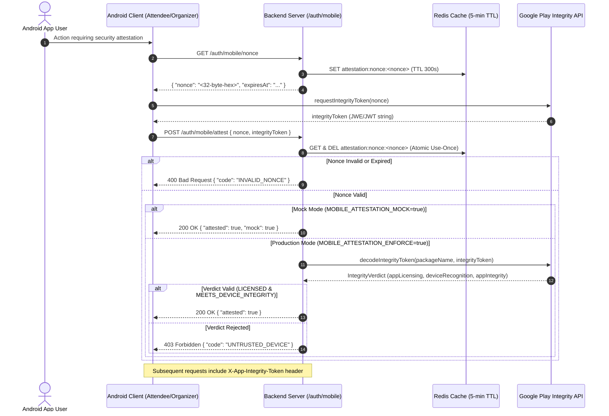

# Task 02-T3: Mobile Attestation & App Integrity Architecture Specification

## 1. Executive Summary
This document specifies the Google Play Integrity API verification architecture for the **Eventing Android Attendee** and **Organizer** mobile applications. It establishes a cryptographically backed security boundary ensuring all high-value backend requests originate from legitimate, un-tampered APK binaries installed via official distribution channels.

---

## 2. Sequence Diagram & Token Flow



---

## 3. Core Specification Parameters

### A. Cryptographic Nonce & Storage Lifecycle
- **Entropy:** 32-byte random hex string generated via `crypto.randomBytes(32).toString('hex')`.
- **Redis Storage Key:** `attestation:nonce:<nonce>`
- **TTL:** 300 seconds (5 minutes).
- **Single-Use Enforcement:** The server atomically fetches and deletes (`GET` + `DEL`) the nonce from Redis upon the first verification attempt to strictly prevent replay attacks.

### B. HTTP Request Headers
- **Header Key:** `X-App-Integrity-Token`
- **Allowed Header in CORS:** Included in `Access-Control-Allow-Headers`.

### C. API Interface Definitions

#### 1. Nonce Request Endpoint
- **HTTP Method:** `GET`
- **Route:** `/auth/mobile/nonce` (and alias `/api/mobile/auth/nonce`)
- **Response (200 OK):**
```json
{
  "nonce": "a1b2c3d4e5f67890123456789abcdef0123456789abcdef0123456789abcdef0",
  "expiresAt": "2026-07-25T20:45:00.000Z"
}
```

#### 2. Attestation Verification Endpoint
- **HTTP Method:** `POST`
- **Route:** `/auth/mobile/attest` (and alias `/api/mobile/auth/attest`)
- **Request Payload:**
```json
{
  "nonce": "a1b2c3d4e5f67890123456789abcdef0123456789abcdef0123456789abcdef0",
  "integrityToken": "eyJhbGciOiJBMjU2S1d...[Google Play Integrity Token]...",
  "packageName": "com.eventing.attendee"
}
```
- **Success Response (200 OK):**
```json
{
  "success": true,
  "attested": true,
  "appLicensingVerdict": "LICENSED",
  "deviceRecognitionVerdict": ["MEETS_DEVICE_INTEGRITY", "MEETS_BASIC_INTEGRITY"],
  "packageName": "com.eventing.attendee",
  "timestampMs": 1784986696185,
  "mock": false
}
```

---

## 4. Production Enforcement vs Local/Mock Mode

| Environment | `MOBILE_ATTESTATION_ENFORCE` | `MOBILE_ATTESTATION_MOCK` | Behavior |
| :--- | :--- | :--- | :--- |
| **Development / Emulator** | `false` | `true` | Mock attestation enabled. Nonces validated from cache. Valid tokens starting with `mock_` return `attested: true`. Emulator test builds supported without Google Play API account. |
| **Staging / Beta** | `false` | `true` | Mock mode with real nonce lifecycle testing. |
| **Production** | `true` | `false` | Strict enforcement. Tokens decoded via Google Play Integrity REST API. Non-attested requests blocked with 403 Forbidden. |

---

## 5. Google Play Integrity Verdict Policy

When decoding tokens in production enforcement mode:
1. `appLicensingVerdict`: Must equal `LICENSED`.
2. `deviceRecognitionVerdict`: Must include `MEETS_DEVICE_INTEGRITY` or `MEETS_STRONG_INTEGRITY`. Rejects `MEETS_VIRTUAL_INTEGRITY` in strict production mode.
3. `appIntegrity`: `packageName` must match `com.eventing.attendee` or `com.eventing.organizer`.
4. `accountDetails`: Validates app licensing account status.

---

## 6. Error Contract

| HTTP Status | Error Code | Description |
| :--- | :--- | :--- |
| `400 Bad Request` | `INVALID_NONCE` | Nonce missing, expired, or already consumed. |
| `400 Bad Request` | `MISSING_TOKEN` | Request payload lacks `integrityToken`. |
| `403 Forbidden` | `ATTESTATION_REQUIRED` | Missing required `X-App-Integrity-Token` header on enforced route. |
| `403 Forbidden` | `UNTRUSTED_DEVICE` | Token verdict failed device recognition or app licensing check. |
| `500 Server Error` | `PROVIDER_CREDENTIALS_MISSING` | Production enforcement enabled but server lacks service account credentials. |

---

## 7. Threat Limits & Rate Protection
- `/auth/mobile/nonce` is rate-limited to **20 requests/minute per IP** to prevent nonce cache flooding.
- `/auth/mobile/attest` is rate-limited to **10 requests/minute per IP**.

---

## 8. Android Client Implementation Reference (Design Only)

```kotlin
// Android Client Reference Architecture (Kotlin)
package com.eventing.mobile.security

import com.google.android.play.core.integrity.IntegrityManagerFactory
import com.google.android.play.core.integrity.StandardIntegrityManager
import com.google.android.play.core.integrity.StandardIntegrityManager.PrepareIntegrityTokenRequest
import com.google.android.play.core.integrity.StandardIntegrityManager.StandardIntegrityTokenRequest

class PlayIntegrityClientManager(private val context: android.content.Context) {

    suspend fun obtainAttestationToken(serverNonce: String): Result<String> {
        return try {
            val integrityManager = IntegrityManagerFactory.createStandard(context)
            val request = PrepareIntegrityTokenRequest.builder()
                .setCloudProjectNumber(123456789012L) // Google Cloud Project Number
                .build()

            // Prepare token provider
            val tokenProvider = integrityManager.prepareIntegrityToken(request).await()

            // Request integrity token using server nonce
            val tokenRequest = StandardIntegrityTokenRequest.builder()
                .setRequestHash(serverNonce)
                .build()
            val response = tokenProvider.request(tokenRequest).await()
            Result.success(response.token())
        } catch (e: Exception) {
            Result.failure(e)
        }
    }
}
```

---

## 9. Verification Evidence & Acceptance Criteria

> [!NOTE]
> Server-side nonce generation, single-use atomic consumption, and mock-mode attestation verification are 100% locally verified. Real production token decryption against Google Play API requires Google Play Console app registration, Google Cloud service account key (`GOOGLE_PLAY_INTEGRITY_CREDENTIALS`), and Play Store binary signing.

### Test / Smoke Script Evidence
- Execution Script: `node server/scripts/smoke/smoke.rate-limit-cors.js` (Test 5)

### Acceptance Criteria
- [x] Nonce issuance endpoint `GET /auth/mobile/nonce` returns valid single-use nonce string with TTL (Verified in `smoke.rate-limit-cors.js` Test 5).
- [x] Nonce consumption `POST /auth/mobile/attest` is single-use atomic; replay attacks with reused nonce rejected with HTTP 400 `INVALID_NONCE` (Verified in `smoke.rate-limit-cors.js` Test 5).
- [x] Mock mode (`MOBILE_ATTESTATION_MOCK=true`) enables local emulator testing without Google Play credentials (Verified in `smoke.rate-limit-cors.js` Test 5).
- [ ] Live Google Play Integrity API token decryption (Requires manual runtime setup with Google Play Console app registration & service account credentials).

