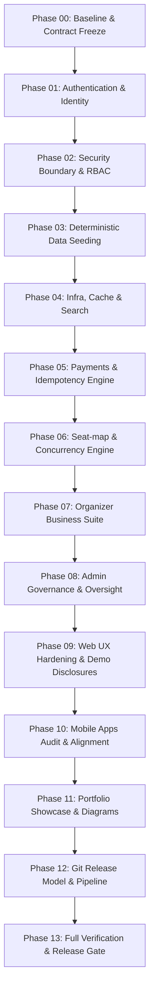

# Portfolio Completion Program — Phase Dependency Graph

## Critical Path Highlights

1. **Phase 00 $\rightarrow$ 01 $\rightarrow$ 02 (Foundation & Boundary):** Baseline contract freeze precedes identity and security boundary enforcement.
2. **Phase 05 $\rightarrow$ 06 $\rightarrow$ 07 (Transaction Core):** Strict Idempotency Engine must be established before seat-hold locking and organizer ticket sales engine.
3. **Phase 07 $\rightarrow$ 08 (Business & Governance):** Admin governance features map directly to organizer platform capabilities.
4. **Phase 12 $\rightarrow$ 13 (Release & Gate):** Safe Git flow and CI/CD pipelines enable the final verification gate before merging to `main`.
