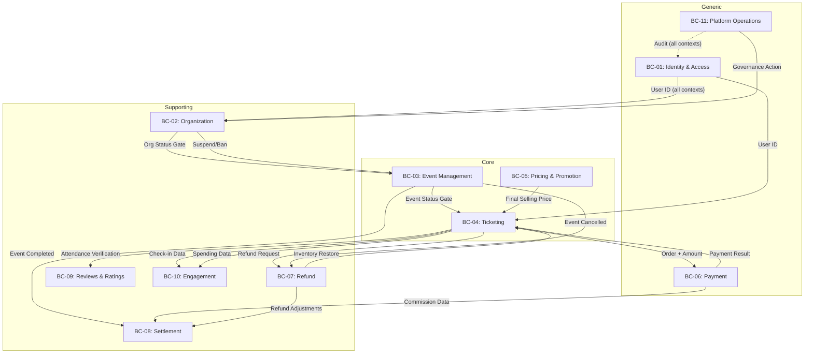

# BOUNDED CONTEXT MAP — Eventing Platform V1

> **Document ID:** EV-BCM-001
> **Version:** 1.0 (Draft)
> **Status:** 🟡 DRAFT — Awaiting PO Approval
> **Last Updated:** 2026-07-10
> **Dependency:** All Phase 1 Business Analysis Documents (00–08)
> **Deliverable #:** Phase 2.1, Item 10

---

## Purpose

This document defines the **Bounded Contexts** of the Eventing Platform following DDD strategic design principles. It establishes context boundaries, concept ownership, upstream/downstream relationships, and integration patterns.

This document is **implementation-independent**. It describes strategic domain architecture only — no aggregates, entities, value objects, domain events, repositories, services, APIs, database tables, messaging infrastructure, or deployment topology.

> [!IMPORTANT]
> **Relationship to Phase 1 Domain Discovery.**
> The Domain Discovery document (07) identified 11 logical business domains (DOM-01 to DOM-11). This document transforms those domains into **Bounded Contexts** with explicit ownership, relationships, and translation boundaries. Domains and contexts have a 1:1 correspondence in V1. Future versions may split or merge contexts as the platform evolves.

---

## Baselined Decisions

The following decisions from the PO are baselined and constrain all context design:

| Decision | Impact on Context Design |
|---|---|
| Organization-centric model (7 roles) | Organization Context owns team structure. Identity Context owns user identity only. |
| Section-Based Seating only (V1) | Ticketing Context manages inventory at Ticket Type level. No seat-level concepts. |
| ONGOING events continue during org suspension | Organization Context suspension affects future activity only. Event Context does not receive ONGOING → SUSPENDED transition. |
| FIFO Waitlist, no priority | Ticketing Context owns waitlist. No external ranking input needed. |
| Fixed Pricing Pipeline (Base → Strategy → Promotion → Final) | Pricing & Promotion Context owns full pipeline. Ticketing queries, does not calculate. |
| Promotion owns Voucher and discount concepts | Voucher Code and Group Discount remain inside Pricing & Promotion Context. |
| Percentage commission only, manual settlement | Payment Context calculates commission. Settlement Context aggregates and initiates payout. |
| Refund cutoff with exceptional post-cutoff review | Refund Context owns policy. Event cancellation refunds bypass cutoff. |

---

## Bounded Context Catalogue

### BC-01: Identity & Access Context

#### Classification: Generic

#### Context Purpose

Manage user identity, authentication, and basic profile. This context answers: **"Who is this person?"**

#### Owned Glossary Terms (2)

| Term | Ownership Note |
|---|---|
| Guest | Pre-registration user state |
| Attendee | Post-registration default role |

#### Owned Business Rules (1)

| Rule | Title | Type |
|---|---|---|
| BR-ORG-01 | Default Attendee Role | ⚙️ Process |

> [!NOTE]
> BR-ORG-01 is prefixed ORG but its policy (every registered user defaults to Attendee) is an identity-level concern. The Organization Context consumes this identity but does not own the default role assignment.

#### Owned Business Capabilities (5)

| Capability | Name |
|---|---|
| USR-01 | Register User |
| USR-02 | Authenticate User |
| USR-03 | Manage User Profile |
| USR-04 | Reset Password |
| USR-05 | Deactivate Account |

#### Owned State Machines

None. User lifecycle is simple (Active / Deactivated) and does not warrant a formal state machine.

#### Ubiquitous Language Within This Context

- **Guest** = unauthenticated browser
- **Attendee** = authenticated registered user (default role)
- **User** = any person interacting with the system (Guest or Attendee)

#### Context Boundary

Owns the concept of **"who you are."** Does NOT know about Organizations, Events, Tickets, or any commercial activity. Other contexts reference User ID only.

---

### BC-02: Organization Context

#### Classification: Supporting

#### Context Purpose

Manage organization lifecycle, team composition, and role-based access governance. This context answers: **"Who is authorized to do what within which organization?"**

#### Owned Glossary Terms (5)

| Term | Ownership Note |
|---|---|
| Organization | Team entity with lifecycle |
| Permission Group | V1 groups: Owner, Manager, Staff |
| Team Member | User accepted into an Organization |
| Organization Suspension | Temporary enforcement action |
| Ban | Permanent deactivation |

#### Owned Business Rules (7)

| Rule | Title | Type |
|---|---|---|
| BR-ORG-02 | Org Approval Gate | ⚙️ Process |
| BR-ORG-03 | Owner Self-Removal Prevention | 🔒 Constraint |
| BR-ORG-04 | Permission Group Assignment | ✅ Action-Enabling |
| BR-ORG-05 | Single Org per Event | 🔒 Constraint |
| BR-ORG-06 | Event Ownership Continuity | 🔒 Constraint |
| BR-ORG-07 | Suspension Effects | 🔒 Constraint |
| BR-ORG-08 | Ban Effects | ⚙️ Process |

#### Owned Business Capabilities (9)

| Capability | Name |
|---|---|
| ORG-01 | Register Organization |
| ORG-02 | Approve Organization |
| ORG-03 | Invite Team Member |
| ORG-04 | Accept Invitation |
| ORG-05 | Remove Team Member |
| ORG-06 | Assign Permission Group |
| ORG-07 | Reassign Permission Group |
| ORG-08 | Update Organization Profile |
| ORG-09 | View Organization Dashboard |

#### Owned State Machines (2)

| SM | Entity | States | Transitions |
|---|---|---|---|
| SM-05 | Organization | 4 (PENDING_REVIEW, ACTIVE, SUSPENDED, BANNED) | 7 |
| SM-08 | Invitation | 4 (PENDING, ACCEPTED, EXPIRED, REVOKED) | 4 |

#### Ubiquitous Language Within This Context

- **Organization** = team entity that creates events
- **Owner** = full-control role within an Organization
- **Manager** = event + finance management permission group
- **Staff** = operational permission group (check-in)
- **Suspended** = temporary operational freeze
- **Banned** = permanent deactivation with financial cleanup

#### Context Boundary

Owns **"team structure and governance."** Knows about permission groups and Organization status. Does NOT know about specific Event details, ticket inventory, or pricing. Downstream contexts react to Organization status changes; only this context can change Organization status.

---

### BC-03: Event Management Context

#### Classification: Core

#### Context Purpose

Manage the full lifecycle of Events — creation, approval, publication, scheduling, and completion. This context answers: **"What happens, where, and when?"**

#### Owned Glossary Terms (3)

| Term | Ownership Note |
|---|---|
| Event | Scheduled occasion with lifecycle |
| Venue | Physical location (attribute of Event in V1) |
| Event Category | Classification label for discovery |

#### Owned Business Rules (8)

| Rule | Title | Type |
|---|---|---|
| BR-EVT-01 | Event Approval Gate | ⚙️ Process |
| BR-EVT-02 | Post-Sale Edit Lock | 🔒 Constraint |
| BR-EVT-03 | Minor Edit Pass-Through | ✅ Action-Enabling |
| BR-EVT-04 | Major Edit Re-Approval | ⚙️ Process |
| BR-EVT-05 | Cancellation Auto-Refund | ⚙️ Process |
| BR-EVT-06 | Event Authorization | 🔒 Constraint |
| BR-EVT-07 | Single Org Ownership | 🔒 Constraint |
| BR-EVT-08 | Min Ticket Type Requirement | ✅ Action-Enabling |

#### Owned Business Capabilities (9)

| Capability | Name |
|---|---|
| EVT-01 | Create Event |
| EVT-02 | Edit Event (Minor) |
| EVT-03 | Edit Event (Major) |
| EVT-04 | Submit Event for Approval |
| EVT-05 | Approve / Reject Event |
| EVT-06 | Cancel Event |
| EVT-07 | Complete Event |
| EVT-08 | Browse / Search Events |
| EVT-09 | View Event Details |

#### Owned State Machines (1)

| SM | Entity | States | Transitions |
|---|---|---|---|
| SM-01 | Event | 9 (DRAFT, PENDING_REVIEW, APPROVED, REJECTED, PUBLISHED, ONGOING, COMPLETED, CANCELLED, SUSPENDED) | 14 |

#### Ubiquitous Language Within This Context

- **Event** = a scheduled occasion (NOT a domain event or system event)
- **Published** = visible to Attendees and open for ticket sales
- **Ongoing** = event is currently happening at the venue
- **Cancelled** = terminated, triggers auto-refund
- **Suspended** = frozen due to Organization suspension (PUBLISHED events only; ONGOING events continue per OBS-16 resolution)

#### Context Boundary

Owns **"what happens and when."** Knows about Event lifecycle, venue, schedule, and approval workflow. Does NOT know about ticket inventory, pricing, payment mechanics, or financial calculations. Downstream contexts consume Event status to gate their own operations.

---

### BC-04: Ticketing Context

#### Classification: Core

#### Context Purpose

Manage ticket inventory, purchase flow, check-in, and waitlist. This context answers: **"Who can attend and how do they get in?"**

#### Owned Glossary Terms (11)

| Term | Ownership Note |
|---|---|
| Ticket Type | Class of admission (Section) with capacity |
| Ticket | Purchased unit of admission |
| Capacity | Maximum tickets per Ticket Type |
| Sales Window | Configurable purchase time range |
| Reservation | Temporary inventory hold |
| Reservation Expiration Period | Configurable hold duration |
| Purchase Limit | Per-account-per-Event maximum |
| Check-in | QR-based venue entry validation |
| QR Code | Unique machine-readable admission code |
| Waitlist | FIFO queue for sold-out Ticket Types |
| Order | Commercial transaction for ticket purchase |

> [!IMPORTANT]
> **Order Ownership Decision.** The Business Glossary places Order under "Domain 6: Payment," but the Domain Discovery document (07) places orders, tickets, and reservations under Ticketing (DOM-04). **This context map assigns Order ownership to Ticketing** because:
> 1. Order creation is triggered by the purchase flow (Ticketing responsibility)
> 2. Order lifecycle (SM-02) is tightly coupled with Reservation (SM-04) and Ticket (SM-03) lifecycles
> 3. Payment Context processes the *financial transaction* for an Order but does not own Order state
> 4. The Glossary domain grouping serves navigation purposes, not ownership (per 07-domain-discovery.md header note)

#### Owned Business Rules (9)

| Rule | Title | Type |
|---|---|---|
| BR-TKT-01 | Published Event Gate | ✅ Action-Enabling |
| BR-TKT-02 | Capacity Enforcement | 🔒 Constraint |
| BR-TKT-03 | Configurable Sales Window | ✅ Action-Enabling |
| BR-TKT-04 | Unique QR / Single Scan | 🔒 Constraint |
| BR-TKT-05 | Reservation Expiration Period | ⚙️ Process |
| BR-TKT-06 | Non-Transferable Tickets | 🔒 Constraint |
| BR-TKT-07 | Multi-Ticket Orders | ✅ Action-Enabling |
| BR-TKT-08 | Price Lock at Purchase | 🔒 Constraint |
| BR-TKT-09 | Purchase Limit | 🔒 Constraint |

#### Owned Business Capabilities (9)

| Capability | Name |
|---|---|
| TKT-01 | Define Ticket Type |
| TKT-02 | Configure Pricing |
| TKT-03 | Reserve Tickets |
| TKT-04 | Purchase Tickets |
| TKT-05 | View My Tickets |
| TKT-06 | Join Waitlist |
| TKT-07 | Cancel Ticket (individual) |
| TKT-08 | Check In |
| TKT-09 | Request Refund |

> [!NOTE]
> TKT-09 (Request Refund) is owned by Ticketing as the **initiation point**. The Refund Context owns the refund decision workflow and policy enforcement. Ticketing initiates; Refund decides.

#### Owned State Machines (4)

| SM | Entity | States | Transitions |
|---|---|---|---|
| SM-02 | Order | 4 (PENDING_PAYMENT, CONFIRMED, EXPIRED, CANCELLED) | 4 |
| SM-03 | Ticket | 4 (ISSUED, CHECKED_IN, CANCELLED, REFUNDED) | 5 |
| SM-04 | Reservation | 3 (ACTIVE, CONSUMED, EXPIRED) | 3 |
| SM-09 | Waitlist Entry | 4 (WAITING, NOTIFIED, PURCHASED, EXPIRED) | 5 |

#### Ubiquitous Language Within This Context

- **Order** = a purchase transaction for one or more tickets within a single Event
- **Reservation** = temporary capacity hold during checkout (NOT a ticket)
- **Capacity** = inventory count per Ticket Type (NOT per seat)
- **Check-in** = QR scan at venue entry
- **Waitlist** = FIFO queue per Ticket Type

#### Context Boundary

Owns **"who can attend and how they get in."** Knows about tickets, orders, inventory (at Ticket Type level), reservations, waitlist, and check-in. Does NOT know how prices are calculated (asks Pricing & Promotion Context). Does NOT process financial transactions (delegates to Payment Context). Does NOT decide refund eligibility (delegates to Refund Context).

#### V2 Expansion Note

V2 seat-selection expansion would introduce seat-level inventory within this context. Current Ticket Type–level design supports this evolution without breaking context boundaries. Seat maps, seat holds, and adjacency logic would extend (not replace) the existing inventory model.

---

### BC-05: Pricing & Promotion Context

#### Classification: Core

#### Context Purpose

Calculate prices and manage promotional discounts. This context answers: **"How much does it cost?"**

#### Owned Glossary Terms (9)

| Term | Ownership Note |
|---|---|
| Base Price | Starting price before adjustments |
| Pricing Strategy | Time-based pricing adjustment (V1: Early Bird only) |
| Early Bird | Specific Pricing Strategy type |
| Pricing Pipeline | Sequential calculation: Base → Strategy → Promotion → Final |
| Final Selling Price | Calculated output of the pipeline |
| Voucher Code | Code-based checkout discount |
| Group Discount | Quantity-based automatic discount |
| Best Benefit Selection | No-stacking resolution mechanism |
| Promotion | Umbrella term for checkout-time discounts |

#### Owned Business Rules (9)

| Rule | Title | Type |
|---|---|---|
| BR-PRC-01 | Early Bird Definition | 🔒 Constraint |
| BR-PRC-02 | Auto-Revert to Base | ⚙️ Process |
| BR-PRC-03 | Single Active Strategy | 🔒 Constraint |
| BR-PRC-04 | Price Transparency | 🔒 Constraint |
| BR-PRC-05 | Pricing Pipeline | 🔢 Computation |
| BR-PRM-01 | Voucher Scope | 🔒 Constraint |
| BR-PRM-02 | Group Discount Threshold | ✅ Action-Enabling |
| BR-PRM-03 | No Discount Stacking | 🔒 Constraint |
| BR-PRM-04 | Best Benefit Selection | 🔢 Computation |

#### Owned Business Capabilities (4)

| Capability | Name |
|---|---|
| PRM-01 | Create Voucher Code |
| PRM-02 | Configure Group Discount |
| PRM-03 | Apply Promotion at Checkout |
| PRM-04 | View Promotion Performance |

> [!NOTE]
> TKT-02 (Configure Pricing) is owned by Ticketing because it sets the Base Price on a Ticket Type. The Pricing Pipeline (BR-PRC-05) is owned by Pricing & Promotion because it orchestrates the full price calculation. This is a clean upstream/downstream relationship.

#### Owned State Machines

None. Pricing and promotion concepts are stateless calculations, not lifecycle entities.

#### Ubiquitous Language Within This Context

- **Pricing Strategy** = time-based automatic price adjustment (NOT a promotion)
- **Promotion** = external checkout-time discount (Voucher or Group Discount)
- **Early Bird** = a Pricing Strategy, NOT a Promotion
- **Final Selling Price** = output of the Pricing Pipeline (input to Payment and Settlement)
- **Best Benefit Selection** = system picks the better deal when both Voucher and Group Discount apply

#### Context Boundary

Owns **"how much it costs."** Knows about pricing rules, strategies, promotions, and the pricing pipeline. Does NOT know about inventory, order state, or payment mechanics. Ticketing asks "what is the final price?" — Pricing & Promotion calculates and returns it.

---

### BC-06: Payment Context

#### Classification: Generic

#### Context Purpose

Process financial transactions and calculate commission. This context answers: **"How does money move in?"**

#### Owned Glossary Terms (3)

| Term | Ownership Note |
|---|---|
| Payment | Financial transaction for an Order |
| Payment Gateway | External processing service (V1: ZaloPay) |
| Commission | Platform fee per ticket sale |

#### Owned Business Rules (5)

| Rule | Title | Type |
|---|---|---|
| BR-PAY-01 | Commission Model | 🔢 Computation |
| BR-PAY-03 | Original Payment Refund | 🔒 Constraint |
| BR-PAY-04 | Immutable Financial Ledger | 🔒 Constraint |
| BR-PAY-05 | Payment Idempotency | 🔒 Constraint |
| BR-PAY-08 | Commission on Discounted Price | 🔢 Computation |

#### Owned Business Capabilities (4)

| Capability | Name |
|---|---|
| PAY-01 | Process Payment |
| PAY-02 | Handle Payment Status Update |
| PAY-03 | Calculate Commission |
| PAY-09 | View Transaction History |

#### Owned State Machines

None. Payment processing is a synchronous or callback-based operation without a multi-step lifecycle in V1. The Order state machine (SM-02, owned by Ticketing) reflects payment outcomes.

#### Ubiquitous Language Within This Context

- **Payment** = the financial charge for an Order (NOT the Order itself)
- **Commission** = platform's percentage fee on Final Selling Price
- **Payment Gateway** = external financial processor (abstracted behind gateway-agnostic interface)
- **Ledger** = immutable financial record

#### Context Boundary

Owns **"how money moves."** Gateway-agnostic transaction processing. Knows about payment amounts, commission rates, and transaction status. Does NOT know about business policies (refund eligibility, ticket validity, event state). Payment Gateway terminology (charge, capture, void) stays inside this context — external contexts speak in "Payment" terms.

#### Anti-Corruption Layer

Payment Gateway integration requires an ACL to translate between platform language (Payment, Commission) and gateway language (charge, capture, refund, webhook). This is the primary ACL candidate in the entire system.

---

### BC-07: Refund Context

#### Classification: Supporting

#### Context Purpose

Evaluate refund eligibility, manage approval workflows, and allocate cancellation costs. This context answers: **"Should the money go back, and who bears the cost?"**

#### Owned Glossary Terms (4)

| Term | Ownership Note |
|---|---|
| Refund | Return of purchase amount |
| Refund Cutoff Period | Time boundary for refund acceptance |
| Event Cancellation | Termination triggering auto-refund |
| Force Majeure | Uncontrollable external event |

#### Owned Business Rules (7)

| Rule | Title | Type |
|---|---|---|
| BR-REF-01 | Manual Refund Approval | ⚙️ Process |
| BR-REF-02 | Auto-Refund on Cancellation | ⚙️ Process |
| BR-REF-03 | Platform-Fault Cost | 🔢 Computation |
| BR-REF-04 | Organizer-Fault Cost | 🔢 Computation |
| BR-REF-05 | Force Majeure Cost | 🔢 Computation |
| BR-REF-06 | Inventory Restoration | ⚙️ Process |
| BR-REF-07 | Refund Cutoff Time | ⚙️ Process |

#### Owned Business Capabilities (1)

| Capability | Name |
|---|---|
| PAY-07 | Process Refund |

> [!NOTE]
> **Rule-dense, capability-thin.** Per OBS-09: this context owns 7 rules but only 1 capability. Its complexity is in decision-making (approval workflow, fault allocation, cost distribution) rather than user-facing features. This is expected for a policy-heavy domain.

#### Owned State Machines (1)

| SM | Entity | States | Transitions |
|---|---|---|---|
| SM-07 | Refund Request | 3 (PENDING, APPROVED, REJECTED) | 3 |

#### Ubiquitous Language Within This Context

- **Refund** = return of money to Attendee (NOT inventory restoration, which is a side effect)
- **Cutoff Period** = pre-event time boundary for normal refund acceptance
- **Cost Allocation** = who pays when an Event is cancelled (Platform-fault, Organizer-fault, Force Majeure)
- **Auto-Refund** = automatic 100% refund triggered by Event cancellation (bypasses cutoff)

#### Context Boundary

Owns **"money back."** Knows about refund eligibility, approval workflow, and cost allocation. Does NOT know about settlement timing, payment gateway details, or ticket inventory. Inventory restoration after refund is communicated to Ticketing Context (cross-context interaction).

---

### BC-08: Settlement Context

#### Classification: Supporting

#### Context Purpose

Calculate post-event financial settlements and process payouts to Organizations. This context answers: **"How much does the organizer get paid?"**

#### Owned Glossary Terms (3)

| Term | Ownership Note |
|---|---|
| Settlement | Post-event financial calculation |
| Cooling Period | Configurable post-event hold period |
| Payout | Transfer of settled funds to Organization |

#### Owned Business Rules (3)

| Rule | Title | Type |
|---|---|---|
| BR-PAY-02 | Post-Event Payout Gate | ✅ Action-Enabling |
| BR-PAY-06 | Settlement Cooling Period | ✅ Action-Enabling |
| BR-PAY-07 | Manual Payout | ⚙️ Process |

#### Owned Business Capabilities (4)

| Capability | Name |
|---|---|
| PAY-04 | Generate Settlement |
| PAY-05 | Review Settlement |
| PAY-06 | Process Payout |
| PAY-08 | View Revenue Report |

#### Owned State Machines (2)

| SM | Entity | States | Transitions |
|---|---|---|---|
| SM-06 | Settlement | 5 (PENDING_CALCULATION, PENDING_REVIEW, APPROVED, PAID, UNDER_REVIEW) | 6 |
| SM-10 | Payout | 2 (PENDING, COMPLETED) | 2 |

#### Ubiquitous Language Within This Context

- **Settlement** = the calculation (NOT the transfer)
- **Payout** = the transfer (NOT the calculation)
- **Cooling Period** = post-event hold for dispute resolution (NOT the Refund Cutoff Period)
- **Net Amount** = Gross Revenue − Commission − Refunds

#### Context Boundary

Owns **"organizer gets paid."** Knows about financial aggregation (gross revenue, commission deductions, refund deductions). Does NOT know about individual payment transaction details or refund eligibility. Consumes aggregated data from Payment Context and adjustment data from Refund Context.

---

### BC-09: Reviews & Ratings Context

#### Classification: Supporting

#### Context Purpose

Manage attendee feedback and content moderation. This context answers: **"What do attendees think?"**

#### Owned Glossary Terms (1)

| Term | Ownership Note |
|---|---|
| Review | Rating + textual feedback for a completed Event |

#### Owned Business Rules (5)

| Rule | Title | Type |
|---|---|---|
| BR-REV-01 | Review Eligibility | ✅ Action-Enabling |
| BR-REV-02 | Cancelled Event Not Reviewable | 🔒 Constraint |
| BR-REV-03 | One Review per Event | 🔒 Constraint |
| BR-REV-04 | No Edit, Delete Only | 🔒 Constraint |
| BR-REV-05 | Content Moderation | ✅ Action-Enabling |

#### Owned Business Capabilities (3)

| Capability | Name |
|---|---|
| REV-01 | Submit Review |
| REV-02 | View Reviews |
| REV-03 | Moderate Reviews |

#### Owned State Machines

None. Reviews are created and optionally deleted. No multi-step lifecycle.

#### Ubiquitous Language Within This Context

- **Review** = attendee feedback (NOT a content approval workflow)
- **Eligible** = checked-in or verified completed purchase
- **Moderation** = platform removal of policy-violating content

#### Context Boundary

Owns **"what attendees think."** Knows about review content and eligibility rules. Does NOT know about ticket purchase details — only queries Ticketing Context for attendance verification (CHECKED_IN status or confirmed purchase).

---

### BC-10: Engagement Context

#### Classification: Supporting

#### Context Purpose

Passively record attendee behavior data for future analytics. This context answers: **"What has this attendee done on the platform?"**

#### Owned Glossary Terms (1)

| Term | Ownership Note |
|---|---|
| Engagement Tracking | Background data capture of attendance and spending |

#### Owned Business Rules

None. Per OBS-10: this context owns 0 rules and 0 state machines. It is a pure data consumer.

#### Owned Business Capabilities (3)

| Capability | Name |
|---|---|
| ENG-01 | Record Attendance |
| ENG-02 | Record Spending |
| ENG-03 | View Engagement Data |

#### Owned State Machines

None. Engagement records are append-only facts.

#### Ubiquitous Language Within This Context

- **Attendance** = the fact that an Attendee checked in to an Event
- **Spending** = the monetary amount an Attendee has spent across Events

#### Context Boundary

Owns **"attendee behavior data."** Passively consumes events from Ticketing (check-in, order confirmation). No active business logic. No rules to enforce. Exists as a standalone context (not merged into Platform Operations) because it has distinct data ownership and future extensibility (ADR-012 mentions future personalization).

---

### BC-11: Platform Operations Context

#### Classification: Generic

#### Context Purpose

Provide cross-cutting operational tooling: audit logging, notifications, content moderation, and governance execution. This context answers: **"How does the platform run?"**

#### Owned Glossary Terms (6)

| Term | Ownership Note |
|---|---|
| Platform Admin | Highest-authority platform role |
| Platform Operations | Team members for approvals and moderation |
| Platform Finance | Team members for financial review |
| Platform Support | Team members for attendee support |
| Audit Log | Immutable action record |
| Notification | System-generated message |

#### Owned Business Rules (3)

| Rule | Title | Type |
|---|---|---|
| BR-AUD-01 | Mandatory Logging | 🔒 Constraint |
| BR-AUD-02 | Audit Immutability | 🔒 Constraint |
| BR-AUD-03 | Audit Entry Requirements | 🔒 Constraint |

#### Owned Business Capabilities (7)

| Capability | Name |
|---|---|
| OPS-01 | Manage Notification Templates |
| OPS-02 | Send Notifications |
| OPS-03 | Maintain Audit Log |
| OPS-04 | Moderate Content |
| OPS-05 | Suspend Organization |
| OPS-06 | Lift Suspension |
| OPS-07 | Ban Organization |

> [!NOTE]
> **OPS-05/06/07 Ownership.** Per OBS-12: These capabilities are placed in Platform Operations because they represent platform governance actions executed by Platform Admin, not self-service organization management. The Organization Context owns the rules (BR-ORG-07/08) that define suspension/ban effects. Platform Operations provides the **operational mechanism** — it triggers the action, and Organization Context enforces the policy.

#### Owned State Machines

None. Audit logs and notifications are append-only records.

#### Ubiquitous Language Within This Context

- **Audit Log** = immutable record of who did what and when
- **Notification** = system-generated message (push or email)
- **Suspension** = (from this context's perspective) a governance action to execute, not a policy to define
- **Ban** = (from this context's perspective) a governance action to execute, not a policy to define

#### Context Boundary

Owns **"operational tooling."** Cross-cutting notifications and audit. Does NOT own business state of other domains. Receives state change signals from all contexts for audit logging. Initiates governance actions (suspend/ban) that are enforced by Organization Context.

---

## Context Relationship Map

### Overview Diagram



### Detailed Relationship Table

| # | Upstream Context | Downstream Context | Relationship Type | Data Flow | Nature |
|---|---|---|---|---|---|
| R-01 | Identity & Access | All Contexts | **Published Language** | User ID, authentication token | Identity reference; all contexts consume User ID |
| R-02 | Organization | Event Management | **Customer-Supplier** | Organization Status (ACTIVE/SUSPENDED/BANNED) | Org status gates event creation and publication |
| R-03 | Event Management | Ticketing | **Customer-Supplier** | Event Status (PUBLISHED/ONGOING/CANCELLED), Event metadata | Event status gates ticket sales; cancellation triggers mass refund chain |
| R-04 | Pricing & Promotion | Ticketing | **Customer-Supplier** | Final Selling Price (calculated) | Ticketing queries price at checkout; Pricing owns calculation |
| R-05 | Ticketing | Payment | **Customer-Supplier** | Order amount, ticket count | Ticketing initiates payment; Payment processes transaction |
| R-06 | Payment | Ticketing | **Callback** | Payment success/failure | Payment result triggers Order state transition in Ticketing |
| R-07 | Ticketing | Refund | **Partnership** | Refund Request (ticket state, eligibility data) | Ticketing initiates; Refund evaluates and decides |
| R-08 | Refund | Ticketing | **Partnership** | Inventory restoration command | Refund approval triggers capacity restoration and waitlist notification |
| R-09 | Event Management | Refund | **Customer-Supplier** | Event Cancelled signal | Event cancellation triggers auto-refund for all tickets |
| R-10 | Event Management | Settlement | **Customer-Supplier** | Event Completed signal | Event completion starts Cooling Period countdown |
| R-11 | Payment | Settlement | **Customer-Supplier** | Commission records, transaction totals | Payment provides per-order financial data for settlement aggregation |
| R-12 | Refund | Settlement | **Customer-Supplier** | Refund amounts processed | Refund adjustments reduce settlement totals |
| R-13 | Ticketing | Reviews & Ratings | **Customer-Supplier** | Attendance verification (CHECKED_IN or confirmed) | Ticketing provides eligibility check for review submission |
| R-14 | Ticketing | Engagement | **Customer-Supplier** | Check-in facts, spending amounts | Ticketing emits attendance and spending data |
| R-15 | Platform Operations | Organization | **Customer-Supplier** | Governance commands (Suspend, Lift, Ban) | Ops triggers action; Organization enforces policy |
| R-16 | Organization | Platform Operations | **Conformist** | Organization status changes | Ops conforms to Organization's status definitions |
| R-17 | All Contexts | Platform Operations | **Published Language** | State change signals | All contexts emit audit events; Ops logs them |

---

## Upstream / Downstream Analysis

### Dependency Direction Summary

```
Identity & Access (upstream to all)
    ↓
Organization (upstream to Event Management)
    ↓
Event Management (upstream to Ticketing, Refund, Settlement)
    ↓
Ticketing (upstream to Payment, Refund, Reviews, Engagement)
    ↓                          ↓
Payment ←→ (callback)    Pricing & Promotion (upstream to Ticketing)
    ↓
Settlement (terminal downstream — consumes from Payment, Refund, Event Management)
```

### Contexts by Dependency Count

| Context | Upstream Dependencies | Downstream Consumers | Net Direction |
|---|---|---|---|
| Identity & Access | 0 | All (10) | **Pure Upstream** |
| Organization | 1 (Identity) | 2 (Event Mgmt, Platform Ops) | Upstream |
| Event Management | 2 (Identity, Organization) | 3 (Ticketing, Refund, Settlement) | Upstream |
| Pricing & Promotion | 1 (Identity) | 1 (Ticketing) | Upstream |
| Ticketing | 3 (Identity, Event Mgmt, Pricing) | 4 (Payment, Refund, Reviews, Engagement) | **Hub** |
| Payment | 2 (Identity, Ticketing) | 2 (Ticketing callback, Settlement) | Balanced |
| Refund | 3 (Identity, Ticketing, Event Mgmt) | 2 (Ticketing, Settlement) | Balanced |
| Settlement | 4 (Identity, Event Mgmt, Payment, Refund) | 0 | **Pure Downstream** |
| Reviews & Ratings | 2 (Identity, Ticketing) | 0 | Pure Downstream |
| Engagement | 2 (Identity, Ticketing) | 0 | Pure Downstream |
| Platform Operations | 1 (Identity) | 1 (Organization) | Cross-cutting |

> [!WARNING]
> **Ticketing as Hub Context (OBS-13).** Ticketing has the highest interaction surface (3 upstream + 4 downstream = 7 relationships). This is inherent to its role as the platform's core commercial transaction processor. Context boundaries must be carefully maintained to prevent it from becoming a "god context." All cross-context interactions are mediated through clean interfaces (query for price, command for payment, request for refund).

---

## Integration Pattern Analysis

### Customer-Supplier Relationships

In these relationships, the upstream context provides data/services and the downstream context consumes them. The upstream team is not obligated to prioritize downstream needs but should provide stable interfaces.

| Upstream | Downstream | Interface Contract |
|---|---|---|
| Organization → Event Management | Org Status | Event Mgmt reacts to status changes. Org defines the states. |
| Event Management → Ticketing | Event Status + Metadata | Ticketing gates sales on Event status. Event Mgmt defines transitions. |
| Event Management → Settlement | Event Completed signal | Settlement starts calculation after Cooling Period. |
| Event Management → Refund | Event Cancelled signal | Refund auto-processes all tickets. |
| Pricing & Promotion → Ticketing | Final Selling Price | Ticketing queries; Pricing calculates. Ticketing must not cache or recalculate. |
| Ticketing → Payment | Order Amount | Payment processes the financial transaction. |
| Ticketing → Reviews & Ratings | Attendance verification | Reviews queries eligibility; Ticketing provides CHECKED_IN / confirmed status. |
| Ticketing → Engagement | Check-in + Spending facts | Engagement passively records. No acknowledgment needed. |
| Payment → Settlement | Commission + Transaction data | Settlement aggregates per-event. |
| Refund → Settlement | Refund deductions | Settlement subtracts from gross revenue. |

### Partnership Relationships

Both contexts depend on each other and must evolve together.

| Context A | Context B | Nature |
|---|---|---|
| Ticketing | Refund | Ticketing initiates refund requests and provides ticket state. Refund decides eligibility and commands inventory restoration. Mutual dependency requires coordinated evolution. |

### Conformist Relationships

The downstream context conforms to the upstream context's model without translation.

| Upstream | Downstream | Nature |
|---|---|---|
| Organization | Platform Operations | Platform Operations conforms to Organization's status model (PENDING_REVIEW, ACTIVE, SUSPENDED, BANNED). No translation needed — Ops uses Org's language directly. |

### Published Language

| Context | Published Language | Consumers |
|---|---|---|
| Identity & Access | User ID format, authentication token | All contexts |
| All Contexts | Audit event format | Platform Operations |

---

## Shared Kernel Candidates

A Shared Kernel is a small, explicitly shared model that two or more contexts agree to maintain jointly. Changes require coordination.

| Candidate | Contexts | Shared Concepts | Recommendation |
|---|---|---|---|
| **Money** | Payment, Settlement, Refund, Pricing & Promotion | Currency, monetary amount representation, rounding rules | ✅ **Recommend as Shared Kernel.** All financial contexts must agree on how money is represented and rounded. This is a small, stable concept unlikely to diverge. |
| **User Identity Reference** | All contexts | User ID format | ✅ **Recommend as Shared Kernel.** Trivially small. All contexts reference User ID in the same way. |
| **Event Reference** | Event Management, Ticketing, Pricing, Settlement, Refund, Reviews | Event ID, Event Status enum | ⚠️ **Consider carefully.** Event ID is stable and can be shared. Event Status enum is defined by Event Management and consumed by others — better modeled as a Published Language than a Shared Kernel to avoid coupling. |

> [!IMPORTANT]
> **Shared Kernel Minimalism.** Only Money and User Identity Reference are recommended as Shared Kernels. All other cross-context data should flow through context relationships (Customer-Supplier, Published Language) to minimize coupling.

---

## Anti-Corruption Layer Candidates

An ACL translates between the upstream context's model and the downstream context's internal model, preventing foreign concepts from leaking in.

| Boundary | Risk | ACL Location | Translation |
|---|---|---|---|
| **Payment ↔ Payment Gateway** | Gateway terminology (charge, capture, void, webhook) leaking into platform language | Payment Context (outbound) | Platform speaks "Payment" and "Commission." ACL translates to/from gateway-specific vocabulary. **Primary ACL in the system.** |
| **Pricing & Promotion ↔ Ticketing** | Pricing calculation logic leaking into checkout flow | Ticketing Context (inbound) | Ticketing asks "what is the final price for this order?" Pricing returns a result. Ticketing never knows HOW the price was calculated. |
| **Refund ↔ Ticketing** | Refund processing logic leaking into ticket management | Ticketing Context (outbound) / Refund Context (inbound) | Ticketing submits a "Refund Request" with ticket state. Refund Context evaluates using its own policy model. Ticketing receives a "Refund Decision" result. |
| **Organization ↔ Event Management** | Organization governance rules leaking into Event rules | Event Management Context (inbound) | Event Management reacts to Organization status changes but does NOT enforce Organization policies. It receives "Organization is Suspended" and applies its own Event-level rules. |
| **Settlement ↔ Payment** | Settlement aggregation logic leaking into payment processing | Settlement Context (inbound) | Payment provides individual transaction records. Settlement performs its own aggregation. No reverse dependency. |

---

## Core / Supporting / Generic Classification

### Classification Summary

| Classification | Contexts | Count | Investment Strategy |
|---|---|---|---|
| **Core** | Event Management, Ticketing, Pricing & Promotion | 3 | Maximum investment. Best talent. Custom-built. These create competitive advantage. |
| **Supporting** | Organization, Refund, Settlement, Reviews & Ratings, Engagement | 5 | Moderate investment. Standard patterns acceptable. Necessary but not differentiating. |
| **Generic** | Identity & Access, Payment, Platform Operations | 3 | Minimal custom investment. Buy or reuse existing solutions where possible. |

### Classification Rationale

| Context | Classification | Rationale |
|---|---|---|
| Event Management | **Core** | Event lifecycle, approval workflow, and content management are central to platform value. How events are discovered and managed IS the product. |
| Ticketing | **Core** | Ticket inventory management, purchase flow, waitlist, and check-in are the primary commercial mechanism. This is where revenue is generated. |
| Pricing & Promotion | **Core** | Dynamic pricing (Early Bird, promotions, group discounts) and the pricing pipeline create competitive advantage. Pricing flexibility differentiates the platform. |
| Organization | **Supporting** | Organization management is essential but follows standard RBAC patterns. Not differentiating — most event platforms have team management. |
| Refund | **Supporting** | Policy-heavy but follows known refund workflow patterns. The cost allocation logic is business-specific but the refund mechanism itself is standard. |
| Settlement | **Supporting** | Financial settlement follows standard marketplace payout patterns. Manual process in V1 further reduces complexity. |
| Reviews & Ratings | **Supporting** | Standard user-generated content pattern. Not differentiating in V1. |
| Engagement | **Supporting** | Pure data collection in V1. Future personalization (ADR-012) could elevate to Core. |
| Identity & Access | **Generic** | Commodity capability. Standard identity provider patterns. Can be delegated to third-party services. |
| Payment | **Generic** | Gateway-agnostic processing. Can leverage existing payment infrastructure. |
| Platform Operations | **Generic** | Standard operational tooling. Audit, notifications, and governance are infrastructure-level concerns. |

---

## Context Complexity Assessment

| Context | Rules | Capabilities | State Machines | Upstream Deps | Downstream Consumers | Complexity |
|---|---|---|---|---|---|---|
| BC-04: Ticketing | 9 | 9 | 4 | 3 | 4 | **High** |
| BC-03: Event Management | 8 | 9 | 1 | 2 | 3 | **High** |
| BC-05: Pricing & Promotion | 9 | 4 | 0 | 1 | 1 | **Medium-High** |
| BC-07: Refund | 7 | 1 | 1 | 3 | 2 | **Medium-High** |
| BC-02: Organization | 7 | 9 | 2 | 1 | 2 | **Medium** |
| BC-08: Settlement | 3 | 4 | 2 | 4 | 0 | **Medium** |
| BC-06: Payment | 5 | 4 | 0 | 2 | 2 | **Medium** |
| BC-09: Reviews & Ratings | 5 | 3 | 0 | 2 | 0 | **Low** |
| BC-01: Identity & Access | 1 | 5 | 0 | 0 | 10 | **Low** |
| BC-11: Platform Operations | 3 | 7 | 0 | 1 | 1 | **Low** |
| BC-10: Engagement | 0 | 3 | 0 | 2 | 0 | **Low** |

---

## Future Split Candidates

| Context | Split Trigger | Potential New Contexts | Rationale |
|---|---|---|---|
| **Ticketing** | V2 seat-selection, high interaction surface | **Inventory Management** (seat maps, capacity, holds) + **Purchase Flow** (orders, checkout, reservations) + **Venue Operations** (check-in, scanning) | Ticketing's 7 cross-context relationships and 4 state machines make it the most likely candidate for decomposition. V2 seat-level inventory would significantly increase complexity. |
| **Pricing & Promotion** | V2+ multi-strategy pricing, loyalty integration | **Pricing Engine** (strategies, pipeline) + **Promotion Management** (vouchers, discounts, campaigns) | If pricing strategies expand beyond Early Bird or promotions gain campaign management features, the two concerns may diverge enough to warrant separation. |
| **Platform Operations** | Scale of audit/notification requirements | **Audit & Compliance** + **Notification Service** | If audit requirements grow (regulatory compliance, data retention policies) or notification channels multiply, these cross-cutting concerns may need dedicated contexts. |
| **Engagement** | V2+ personalization, loyalty program | **Loyalty & Rewards** + **Analytics & Insights** | Per ADR-012, engagement data is collected for future use. When personalization features arrive, this context will likely split. |

---

## Deferred Contexts (V2+)

These contexts do not exist in V1 but are anticipated based on Charter scope and ADR decisions:

| Future Context | Trigger | Relationship to V1 Contexts |
|---|---|---|
| **Seat Selection** | ADR-001 defers custom seat maps to V2+ | Would extend Ticketing Context with seat-level inventory, seat map editor, adjacency logic, and seat hold mechanics. |
| **Loyalty & Rewards** | ADR-012 captures engagement data for future personalization | Would consume Engagement Context data and potentially influence Pricing & Promotion (loyalty discounts). |
| **Featured Profiles** | ASM-03 excludes from V1 | Would extend Organization Context with premium visibility features and promotional placement. |
| **Analytics & Reporting** | Natural platform evolution | Would consume data from multiple contexts (Ticketing, Payment, Engagement, Reviews) for business intelligence. |
| **Multi-Organization Events** | Potential collaborative event model | Would require rethinking BR-EVT-07 (Single Org Ownership) and Organization → Event Management relationship. |

---

## Validation Results

### 1. Glossary Term Ownership — Single Owner Per Term ✅

| Context | Terms Owned | Count |
|---|---|---|
| Identity & Access | Guest, Attendee | 2 |
| Organization | Organization, Permission Group, Team Member, Organization Suspension, Ban | 5 |
| Event Management | Event, Venue, Event Category | 3 |
| Ticketing | Ticket Type, Ticket, Capacity, Sales Window, Reservation, Reservation Expiration Period, Purchase Limit, Check-in, QR Code, Waitlist, Order | 11 |
| Pricing & Promotion | Base Price, Pricing Strategy, Early Bird, Pricing Pipeline, Final Selling Price, Voucher Code, Group Discount, Best Benefit Selection, Promotion | 9 |
| Payment | Payment, Payment Gateway, Commission | 3 |
| Refund | Refund, Refund Cutoff Period, Event Cancellation, Force Majeure | 4 |
| Settlement | Settlement, Cooling Period, Payout | 3 |
| Reviews & Ratings | Review | 1 |
| Engagement | Engagement Tracking | 1 |
| Platform Operations | Platform Admin, Platform Operations, Platform Finance, Platform Support, Audit Log, Notification | 6 |
| **Total** | | **48** ✅ |

**Result:** Every glossary term has exactly one context owner. No overlaps.

### 2. Business Capability Ownership — Single Primary Context ✅

| Context | Capabilities | Count |
|---|---|---|
| Identity & Access | USR-01 to USR-05 | 5 |
| Organization | ORG-01 to ORG-09 | 9 |
| Event Management | EVT-01 to EVT-09 | 9 |
| Ticketing | TKT-01 to TKT-09 | 9 |
| Pricing & Promotion | PRM-01 to PRM-04 | 4 |
| Payment | PAY-01, PAY-02, PAY-03, PAY-09 | 4 |
| Refund | PAY-07 | 1 |
| Settlement | PAY-04, PAY-05, PAY-06, PAY-08 | 4 |
| Reviews & Ratings | REV-01 to REV-03 | 3 |
| Engagement | ENG-01 to ENG-03 | 3 |
| Platform Operations | OPS-01 to OPS-07 | 7 |
| **Total** | | **58** ✅ |

**Result:** Every capability belongs to exactly one primary context. No overlaps.

### 3. Business Rule Ownership — Single Policy Owner ✅

| Context | Rules Owned | Count |
|---|---|---|
| Identity & Access | BR-ORG-01 | 1 |
| Organization | BR-ORG-02 to BR-ORG-08 | 7 |
| Event Management | BR-EVT-01 to BR-EVT-08 | 8 |
| Ticketing | BR-TKT-01 to BR-TKT-09 | 9 |
| Pricing & Promotion | BR-PRC-01 to BR-PRC-05, BR-PRM-01 to BR-PRM-04 | 9 |
| Payment | BR-PAY-01, BR-PAY-03, BR-PAY-04, BR-PAY-05, BR-PAY-08 | 5 |
| Refund | BR-REF-01 to BR-REF-07 | 7 |
| Settlement | BR-PAY-02, BR-PAY-06, BR-PAY-07 | 3 |
| Reviews & Ratings | BR-REV-01 to BR-REV-05 | 5 |
| Platform Operations | BR-AUD-01 to BR-AUD-03 | 3 |
| Engagement | (none) | 0 |
| **Total** | | **57** ✅ |

**Result:** Every business rule has exactly one policy owner. No overlaps.

### 4. No Duplicate Concept Ownership ✅

Cross-checked: No concept appears in more than one context's ownership table. Shared concepts (User ID, Event Status, Final Selling Price, Commission) have explicit ownership with defined consumer relationships.

### 5. V2 Seat-Selection Expansion ✅

Ticketing Context manages inventory at Ticket Type level. V2 seat-level inventory would extend (not replace) the existing model within the Ticketing Context boundary. No context boundary changes required.

### 6. Promotion Concepts Inside Pricing & Promotion ✅

Voucher Code, Group Discount, Best Benefit Selection, and Promotion all remain inside BC-05 (Pricing & Promotion). No promotion concepts leaked into Ticketing or Orders.

### 7. Implementation Independence ✅

No aggregates, entities, value objects, domain events, repositories, services, APIs, database tables, message queues, or infrastructure decisions are referenced in this document.

---

## Open Ambiguities

| ID | Ambiguity | Affected Contexts | Recommendation |
|---|---|---|---|
| AMB-01 | **Order placement in Glossary vs Domain Discovery.** Glossary places Order under "Domain 6: Payment." Domain Discovery and this Context Map assign it to Ticketing. The Glossary domain grouping serves navigation, not ownership. | BC-04, BC-06 | Align Glossary to state Order is owned by Ticketing, referenced by Payment. Low priority — Glossary header note already explains domain numbering differences. |
| AMB-02 | **OPS-05/06/07 execution vs policy ownership.** Platform Operations executes suspend/lift/ban actions. Organization Context owns the policy rules (BR-ORG-07/08). Both contexts must agree on the governance interface. | BC-02, BC-11 | Define a clean "Governance Action" interface between Platform Operations (trigger) and Organization (enforce) in Phase 2.2. |
| AMB-03 | **BR-REF-06 (Inventory Restoration) crosses Refund → Ticketing boundary.** Refund owns the rule but Ticketing owns inventory. The rule commands a side effect in another context. | BC-04, BC-07 | Model as a Partnership interaction. Refund decides eligibility; Ticketing executes inventory restoration. Both contexts must agree on the restoration contract. |

---

## Summary Statistics

| Metric | Value |
|---|---|
| **Total Bounded Contexts** | 11 |
| **Core Contexts** | 3 (Event Management, Ticketing, Pricing & Promotion) |
| **Supporting Contexts** | 5 (Organization, Refund, Settlement, Reviews & Ratings, Engagement) |
| **Generic Contexts** | 3 (Identity & Access, Payment, Platform Operations) |
| **Total Glossary Terms Mapped** | 48 / 48 |
| **Total Capabilities Mapped** | 58 / 58 |
| **Total Rules Mapped** | 57 / 57 |
| **Context Relationships** | 17 |
| **Shared Kernel Candidates** | 2 (Money, User Identity Reference) |
| **ACL Candidates** | 5 |
| **Partnership Relationships** | 1 (Ticketing ↔ Refund) |
| **Future Split Candidates** | 4 |
| **Deferred V2+ Contexts** | 5 |
| **Open Ambiguities** | 3 |

---

> **End of Bounded Context Map V1.0**
