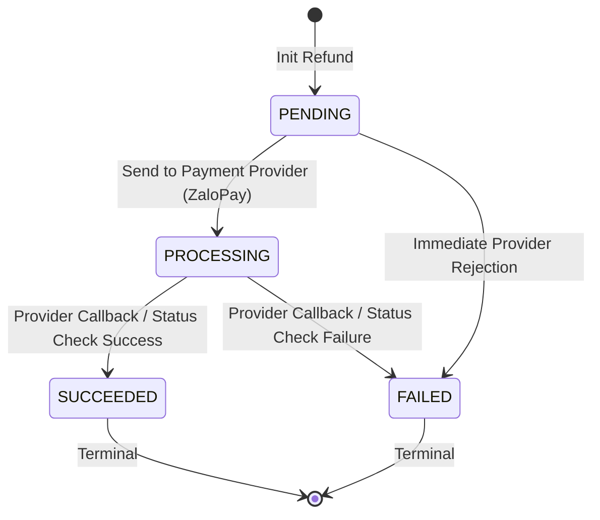
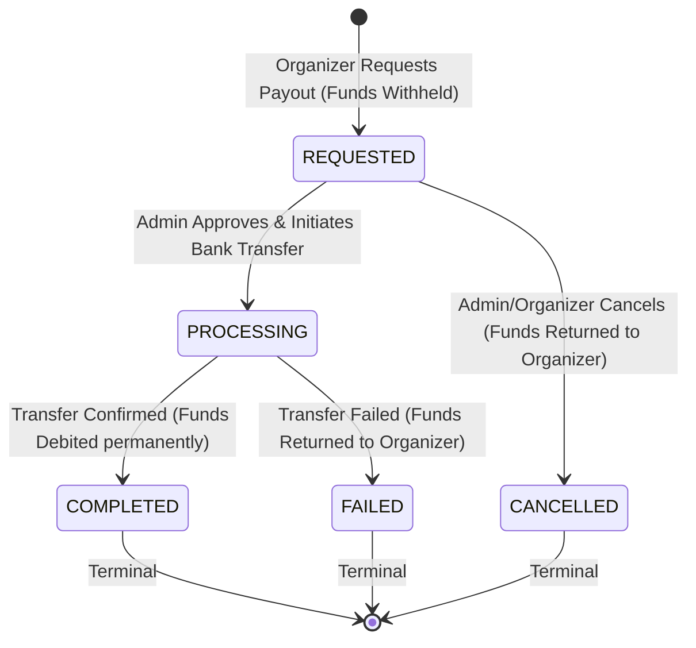

# Design Document: Refunds and Payouts Architecture

This document describes the technical architecture, state transition machines, and database schemas for processing customer refunds and organizer payouts within the Eventing backend.

## 1. Refund Architecture

### A. Refund State Machine



### B. Refund Schema Proposal

```sql
CREATE TABLE IF NOT EXISTS refunds (
    id TEXT PRIMARY KEY,
    order_id TEXT NOT NULL REFERENCES orders(id),
    payment_attempt_id TEXT NOT NULL REFERENCES payment_attempts(id),
    amount NUMERIC NOT NULL,
    status TEXT NOT NULL CHECK (status IN ('pending', 'processing', 'succeeded', 'failed')),
    reason TEXT,
    provider_refund_id TEXT,
    created_at BIGINT NOT NULL,
    updated_at BIGINT NOT NULL
);

CREATE INDEX IF NOT EXISTS idx_refunds_order ON refunds(order_id);
```

### C. Transactional Accounting Rules (Option A: Proportional Split)

When a refund transition reaches the `SUCCEEDED` status, the following operations must execute transactionally:
1. Update `refunds` status to `'succeeded'`.
2. Insert a negative entry in `ledger_entries` representing the reverse transaction.
3. Proportional deduction:
   - Deduct `net_amount` from `organizer_balances`.
   - Deduct `platform_fee` from `platform_fees`.

---

## 2. Payout Architecture

### A. Payout State Machine



### B. Payout Schema Proposal

```sql
CREATE TABLE IF NOT EXISTS payouts (
    id TEXT PRIMARY KEY,
    organizer_id TEXT NOT NULL,
    amount NUMERIC NOT NULL,
    status TEXT NOT NULL CHECK (status IN ('requested', 'processing', 'completed', 'failed', 'cancelled')),
    bank_account_info JSONB NOT NULL,
    receipt_url TEXT, -- Uploaded by admin to verify execution
    failure_reason TEXT,
    provider_payout_id TEXT,
    created_at BIGINT NOT NULL,
    updated_at BIGINT NOT NULL
);

CREATE INDEX IF NOT EXISTS idx_payouts_organizer ON payouts(organizer_id);
```

### C. Transactional Accounting Rules (Withholding Mechanism)

To prevent double-payouts and overdrafts under concurrency, we withhold requested funds:
1. **payout:request**:
   - Acquire a row-lock (`FOR UPDATE`) on `organizer_balances` for `organizer_id`.
   - Verify `balance >= payout_amount`.
   - Deduct `payout_amount` from `organizer_balances.balance`.
   - Insert new payout record with status `'requested'`.
2. **payout:complete**:
   - Update status to `'completed'`.
   - Attach admin verification details (receipt, bank reference).
3. **payout:fail** / **payout:cancel**:
   - Update status to `'failed'` / `'cancelled'`.
   - Return the withheld funds back to `organizer_balances.balance`:
     `balance = balance + payout_amount`.
